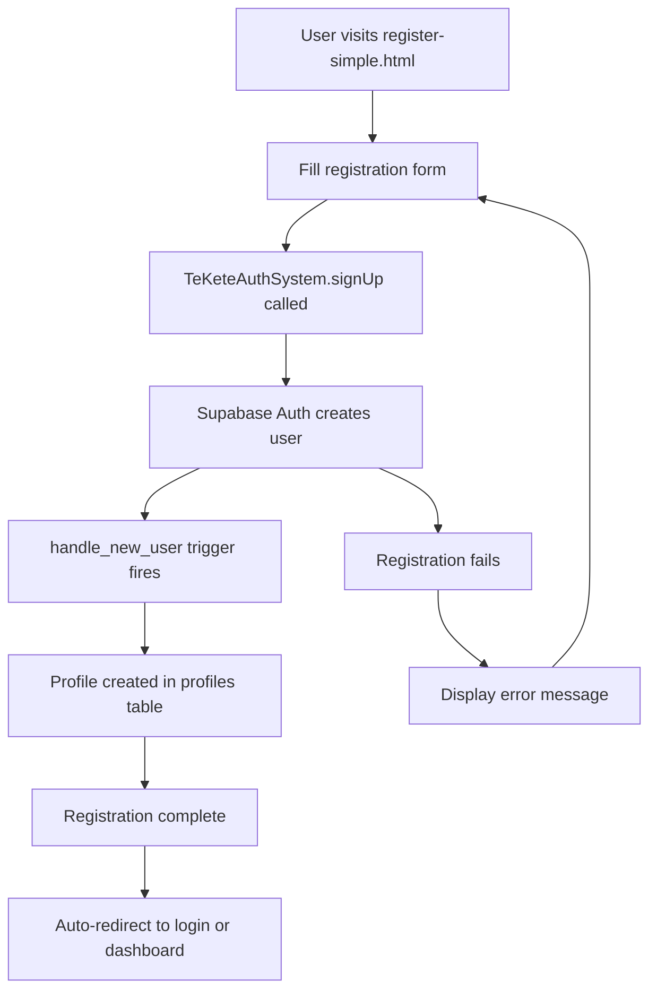
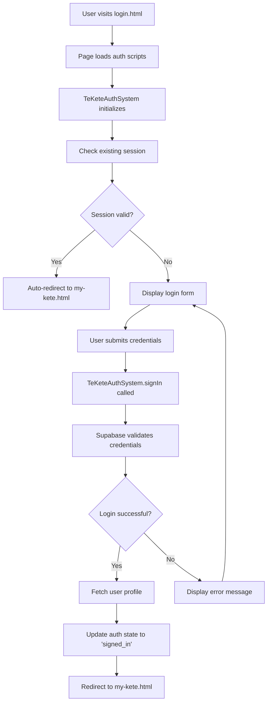
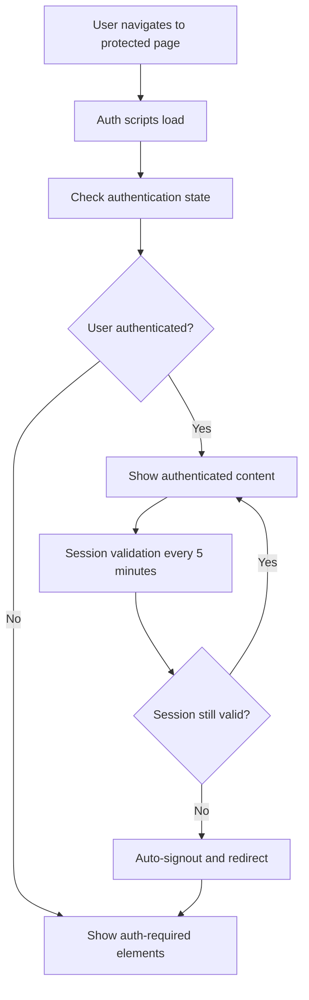

# AUTHENTICATION ARCHITECTURE - Te Kete Ako System Design
## Comprehensive System Architecture & Implementation Guide

### 🏗️ System Overview
Te Kete Ako implements a layered authentication architecture using Supabase as the backend with a sophisticated frontend system designed for educational environments. The system prioritizes reliability, cultural sensitivity, and ease of use for New Zealand schools.

---

## 🎯 Authentication System Components

### Core Architecture Layers
```
┌─────────────────────────────────────────────────────────────┐
│                    USER INTERFACE LAYER                     │
│  ┌─────────────────┐  ┌─────────────────┐  ┌─────────────────┐ │
│  │   Login Pages   │  │  Dashboard UI   │  │  Auth Controls  │ │
│  └─────────────────┘  └─────────────────┘  └─────────────────┘ │
└─────────────────────────────────────────────────────────────┘
┌─────────────────────────────────────────────────────────────┐
│                 APPLICATION LOGIC LAYER                     │
│  ┌─────────────────┐  ┌─────────────────┐  ┌─────────────────┐ │
│  │ TeKeteAuthSystem│  │ AuthResilienceMgr│  │  Role Manager   │ │
│  └─────────────────┘  └─────────────────┘  └─────────────────┘ │
└─────────────────────────────────────────────────────────────┘
┌─────────────────────────────────────────────────────────────┐
│                 CLIENT INTEGRATION LAYER                    │
│  ┌─────────────────┐  ┌─────────────────┐  ┌─────────────────┐ │
│  │ Supabase Client │  │  Session Mgmt   │  │  Token Refresh  │ │
│  └─────────────────┘  └─────────────────┘  └─────────────────┘ │
└─────────────────────────────────────────────────────────────┘
┌─────────────────────────────────────────────────────────────┐
│                    BACKEND SERVICES                         │
│  ┌─────────────────┐  ┌─────────────────┐  ┌─────────────────┐ │
│  │ Supabase Auth   │  │  Database/RLS   │  │  Email Service  │ │
│  └─────────────────┘  └─────────────────┘  └─────────────────┘ │
└─────────────────────────────────────────────────────────────┘
```

---

## 📂 File Structure & Dependencies

### Authentication Core Files
```
/public/js/
├── env-config.js              # Environment configuration singleton
├── supabase-client.js         # Supabase client initialization & CDN fallback  
├── auth-enhanced.js           # Main TeKeteAuthSystem class
├── auth-resilience.js         # Error handling & session recovery
├── auth-ui.js                 # UI components and state management
└── auth-diagnostics.js        # Development debugging tools

/public/vendor/
└── supabase.min.js           # Self-hosted Supabase UMD library

/public/                      # Authentication Pages
├── login.html                # Primary login interface
├── register-simple.html      # User registration
├── forgot-password.html      # Password recovery
├── reset-password.html       # Password reset form
├── verify-email.html         # Email verification
└── my-kete.html             # Authenticated user dashboard
```

### Database Schema
```
supabase/
├── migrations/
│   └── 20250726_handle_new_user.sql    # User profile creation trigger
└── AUTHENTICATION_RLS_FIX.sql         # Row Level Security policies

Database Tables:
- auth.users                           # Supabase managed users
- public.profiles                      # Extended user profiles with roles
  ├── id (uuid, FK to auth.users)
  ├── email (text)
  ├── role (text: student|teacher|admin)  
  ├── full_name (text)
  ├── school (text)
  └── created_at (timestamp)
```

---

## 🔄 Authentication Flow Diagram

### User Registration Flow


### User Login Flow  


### Session Management Flow


---

## 🎭 Page Responsibilities

### Page-Level Authentication Roles

#### 🔓 Public Pages (No Auth Required)
- **index.html** - Homepage with limited functionality
- **about.html** - Site information
- **handouts.html** - Public educational resources
- **lessons.html** - Public lesson previews

#### 🔒 Authentication Pages (Auth Workflow)
- **login.html** 
  - Handles user sign-in
  - Auto-redirects authenticated users
  - Provides error handling and recovery
  - Initializes full auth system

- **register-simple.html**
  - New user account creation  
  - Form validation and user feedback
  - Role selection (student/teacher)
  - Auto-redirect post-registration

- **forgot-password.html**
  - Password recovery initiation
  - Email sending confirmation
  - Links to reset-password.html

- **reset-password.html**
  - Password reset completion
  - Token validation
  - New password setting

#### 🛡️ Protected Pages (Auth Required)
- **my-kete.html**
  - Personal dashboard
  - Bookmark management
  - Progress tracking
  - Role-based feature access

- **student-dashboard.html**
  - Student-specific learning tools
  - Progress visualization
  - Assignment submission

- **teacher-dashboard.html** 
  - Teacher-specific resources
  - Class management
  - Advanced educational tools

#### 🔧 Diagnostic Pages (Development)
- **auth-diagnostics.html**
  - Real-time auth state debugging
  - Configuration validation
  - Network connectivity testing

---

## ⚙️ System Configuration

### Environment Variables (env-config.js)
```javascript
window.ENV = {
    SUPABASE_URL: 'https://nlgldaqtubrlcqddppbq.supabase.co',
    SUPABASE_ANON_KEY: 'eyJhbGciOiJIUzI1NiIsInR5cCI6IkpXVCJ9...',
    NEO4J_URI: 'neo4j+s://cd5763ca.databases.neo4j.io',
    NODE_ENV: 'production|development',
    IS_DEVELOPMENT: boolean,
    IS_CONFIGURED: boolean
}
```

### Supabase Configuration
```javascript
// Client configuration in supabase-client.js
supabaseClient = window.supabase.createClient(supabaseUrl, supabaseKey, {
    auth: {
        autoRefreshToken: true,        // Automatic token renewal
        persistSession: true,          # Session persistence across browser restarts
        detectSessionInUrl: true,      # Handle auth redirects
        flowType: 'pkce'              # Enhanced security flow
    }
});
```

### Row Level Security (RLS) Policies
```sql
-- Allow users to manage their own profiles
CREATE POLICY "authenticated_users_own_profile" ON public.profiles
  FOR ALL USING (auth.uid() = user_id) WITH CHECK (auth.uid() = user_id);

-- Allow signup trigger to create profiles
CREATE POLICY "allow_signup_trigger_insert" ON public.profiles
  FOR INSERT WITH CHECK (true);
```

---

## 🎯 Role-Based Access Control

### User Roles Hierarchy
```
┌─────────────────────────────────────────────────────────────┐
│                        ADMIN                                │
│  ┌─────────────────────────────────────────────────────────┐ │
│  │ • Full system access                                    │ │
│  │ • User management                                       │ │
│  │ • System configuration                                  │ │
│  │ • All teacher + student capabilities                    │ │
│  └─────────────────────────────────────────────────────────┘ │
└─────────────────────────────────────────────────────────────┘
┌─────────────────────────────────────────────────────────────┐
│                       TEACHER                               │
│  ┌─────────────────────────────────────────────────────────┐ │
│  │ • Class management                                      │ │
│  │ • Progress tracking                                     │ │
│  │ • Advanced educational tools                            │ │
│  │ • All student capabilities                              │ │
│  └─────────────────────────────────────────────────────────┘ │
└─────────────────────────────────────────────────────────────┘
┌─────────────────────────────────────────────────────────────┐
│                       STUDENT                               │
│  ┌─────────────────────────────────────────────────────────┐ │
│  │ • Personal learning dashboard                           │ │
│  │ • Resource bookmarking                                  │ │
│  │ • Progress tracking                                     │ │
│  │ • Assignment submission                                 │ │
│  └─────────────────────────────────────────────────────────┘ │
└─────────────────────────────────────────────────────────────┘
```

### Role Implementation
```javascript
// Role checking methods in TeKeteAuthSystem
getUserRole() {
    return this.currentUser?.profile?.role || 'student';
}

hasRole(role) {
    return this.getUserRole() === role;
}

// Usage examples
if (window.teKeteAuth.hasRole('teacher')) {
    showTeacherFeatures();
} else if (window.teKeteAuth.hasRole('admin')) {
    showAdminPanel();
}
```

---

## 🔧 Error Handling & Resilience

### Multi-Layer Error Recovery

#### 1. Network Error Handling (AuthResilienceManager)
```javascript
class AuthResilienceManager {
    constructor() {
        this.networkRetries = 0;
        this.maxNetworkRetries = 5;
        this.isOnline = navigator.onLine;
    }
    
    handleNetworkReconnection() {
        // Retry failed authentication operations
        // Validate session when network returns
        // Sync any queued operations
    }
}
```

#### 2. Session Recovery
```javascript
// Automatic session validation every 5 minutes
setupSessionValidation() {
    this.sessionCheckInterval = setInterval(async () => {
        if (this.authState === 'signed_in') {
            await this.validateCurrentSession();
        }
    }, 5 * 60 * 1000);
}
```

#### 3. CDN Fallback Strategy
```javascript
// If Supabase CDN fails, provide graceful degradation
if (!window.supabase) {
    console.error('❌ Supabase CDN not loaded - falling back to basic functionality');
    window.supabase = {
        createClient: () => ({
            auth: {
                getUser: () => Promise.resolve({ data: { user: null } }),
                signInWithPassword: () => Promise.resolve({ error: { message: 'CDN loading issue' } })
            }
        })
    };
}
```

---

## 📱 Multi-Tab Synchronization

### Cross-Tab Authentication State
```javascript
// Listen for auth changes in other tabs
setupMultiTabSync() {
    window.addEventListener('storage', (e) => {
        if (e.key === this.sessionStorageKey) {
            const sessionData = JSON.parse(e.newValue);
            this.handleCrossTabAuthChange(sessionData);
        }
    });
}
```

---

## 🔍 Development & Debugging

### Authentication State Debugging
```javascript
// Available on any page with auth system loaded
window.debugAuth = function() {
    return {
        systemLoaded: !!window.teKeteAuth,
        authState: window.teKeteAuth?.authState,
        currentUser: window.teKeteAuth?.getCurrentUser(),
        userRole: window.teKeteAuth?.getUserRole(),
        environmentConfig: window.ENV,
        supabaseClient: !!window.supabaseClient,
        lastError: window.teKeteAuth?.lastError
    };
};
```

### Common Debug Commands
```javascript
// Check system status
console.log(window.debugAuth());

// Force session validation
await window.teKeteAuth.validateCurrentSession();

// Test auth state changes
window.teKeteAuth.notifyAuthChange('test');

// Check environment configuration  
console.log(window.checkEnvironmentConfig());
```

---

## 🚀 Performance Optimizations

### Lazy Loading Strategy
- Auth scripts use `defer` attribute to avoid render blocking
- Supabase client initializes asynchronously
- UI updates happen only when auth state changes

### Caching & Storage
- Session data persisted in browser storage
- Auth state cached to avoid repeated API calls
- Profile data cached after first successful login

### Network Efficiency
- Single Supabase client instance across all pages
- Exponential backoff for retry operations
- Connection pooling via Supabase client configuration

---

## 🛡️ Security Considerations

### Content Security Policy Integration
- Strict CSP headers on all pages
- Whitelisted domains for Supabase connections
- No eval() or unsafe-eval usage

### Token Management
- Automatic token refresh before expiration
- Secure token storage in httpOnly cookies (via Supabase)
- Session timeout handling

### Input Validation
- Email format validation on client and server
- Password complexity requirements
- XSS prevention in all user inputs

---

This architecture provides a robust, scalable authentication system that balances security with usability for educational environments. The modular design allows for easy maintenance and feature expansion while maintaining consistency across all Te Kete Ako applications.